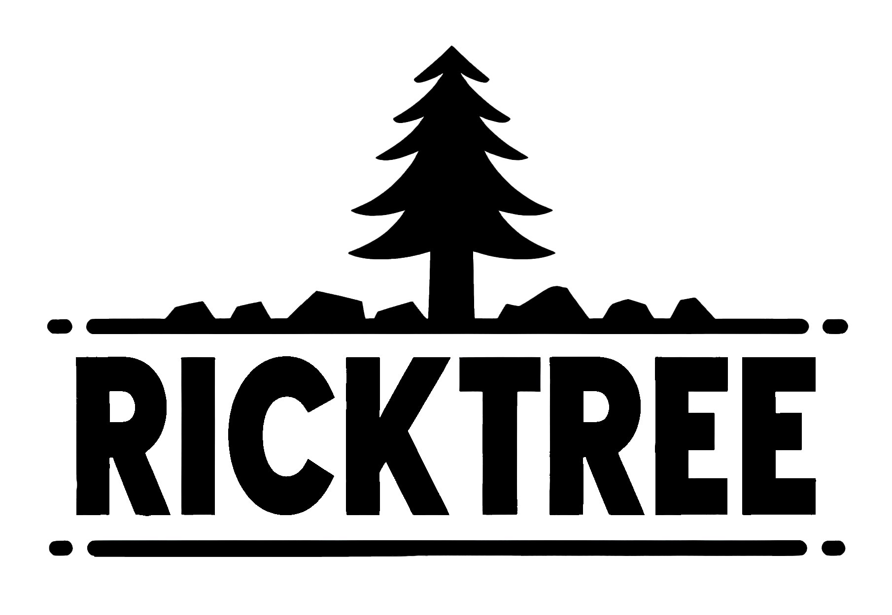

🌍 *Portuguese ∙ English*

<p align="center">
  
</p>

<h1 align="center">Ricktree - Links</h1>

<div align="center">
  <strong>🔗 Centralize your contact and informative links in one place 🌐</strong>
</div>

## 🔭 Overview

Ricktree is an online tool that allows you to group and share all your important links on a single customized page. Ideal for social media profiles, portfolios, businesses, and anyone who wants to organize their links in a practical and accessible way.

## 🌟 Features

Ricktree offers a series of features designed to enhance your online presence and facilitate the sharing of your important links:

- 📌 **Link Centralization**: Organize all your important links in a centralized location, making access easier for your followers.
- 🌓 **Theme Switching**: Choose between **Dark** and **Light** themes for comfortable viewing in any environment.
- 🖌️ **Intuitive Interface**: A clean and intuitive user interface that makes customization and use a breeze.
- 📱 **Multiplatform Compatibility**: Perfect for viewing on any device, whether desktop, tablet, or smartphone.
- 🌍 **Multilingual Support** *(Coming soon)*: Expand your global reach with support for multiple languages, including automatic translations.

Each feature is designed with ease of use and efficiency in mind, allowing you to focus on what's most important - creating amazing content and connecting with your audience.

<p align="center">
  
</p>

> [!NOTE]
> Ricktree is an independent project and is not affiliated with Linktree or any other company. This project was developed with the goal of creating an open-source alternative that anyone can customize and host on their own.

## 🔗 Links 

- ✨ Try Ricktree here: Demo

## 💻 Technologies

- **JavaScript**: Programming language used to create dynamic interactions on the client side.
- **TypeScript**: A superset of JavaScript that adds static typing to improve code maintenance and scalability.
- **React.js**: JavaScript library for building user interfaces with reusable and reactive components.
- **Next.js**: React framework that enables features such as server-side rendering and static site generation.
- **Chakra UI**: A library of styled and accessible components for React that facilitates the construction of consistent interfaces.
- **Emotion**: CSS-in-JS library that allows you to write styles with JavaScript and incorporate them into React components.
- **Framer Motion**: Library for animations and gestures in React, providing a more fluid and interactive user experience.
- **Lucide Icons**: A set of open-source icons carefully designed to be simple and expressive.

## ⚙️ Environment Setup 

To run the project locally in a development environment, make sure you have Node.js and npm (or yarn) installed. Then, follow these steps:

1. Clone the project 
   ```
   git clone https://github.com/rwbe/ricktree
   ```
2. Navigate to the project directory:
   ```
   cd ricktree
   ```
3. Install the dependencies using npm or yarn:
   ```
   npm install ou yarn install
   ```
4. Start the development server:
   ```
   npm run dev ou yarn dev
   ```
5. Open the application in your browser. By default, it will be available at:
   ```
   http://localhost:3000
   ```

## 🚀 Author

> This project was created by [**Ricardo Willian**](https://github.com/rwbe) as an open-source alternative inspired by the functionalities offered by Linktree.

## ⭐️ Support

If you liked Ricktree and wish to support the project, consider leaving a star on the GitHub repository or sharing it on social media. Additionally, contributions are always welcome! If you have suggestions for improvements, corrections, or new features, feel free to make a Pull Request or open an Issue in the repository.

## 📜 Licença

This project is distributed under the [MIT License](LICENSE), allowing free use, modification, and distribution, as long as the same license and recognition of the original authors are maintained.

---
