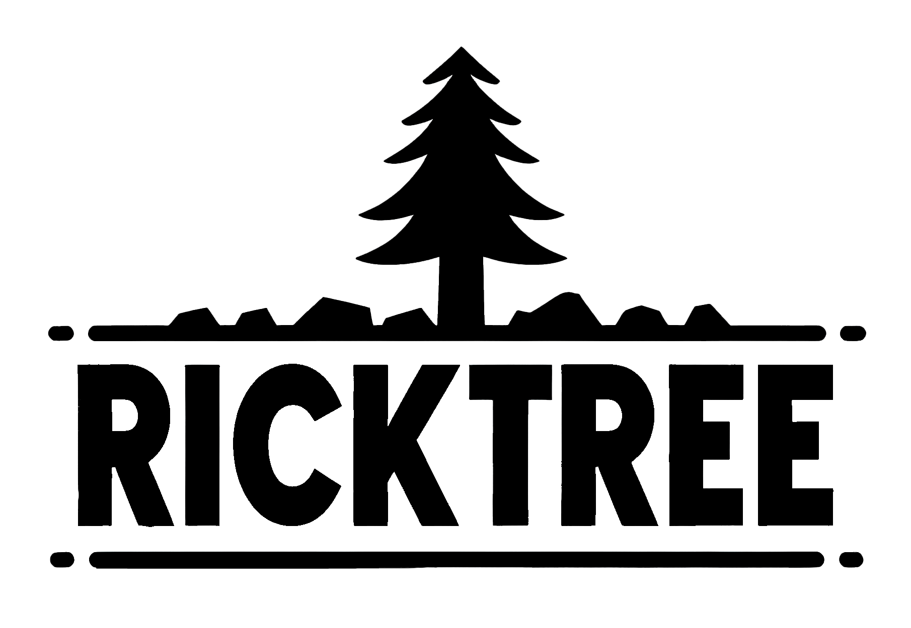
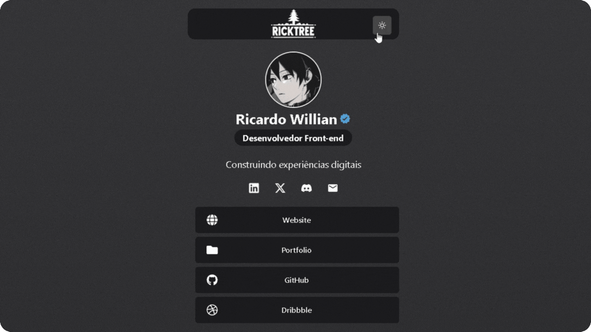

🌍 *[Português](README.md) ∙ [English](README-EN.md)*

<p align="center">
  
</p>

<h1 align="center">Ricktree - Links</h1>

<div align="center">
  <strong>🔗 Centralize seus links de contato e informativos em um só lugar 🌐</strong>
</div>

## 🔭 Visão Geral

Ricktree é uma ferramenta online que permite agrupar e compartilhar todos os seus links importantes em uma única página personalizada. Ideal para perfis de redes sociais, portfólios, empresas e qualquer um que queira organizar seus links de forma prática e acessível.

## 🌟 Funcionalidades

Ricktree oferece uma série de recursos projetados para melhorar sua presença online e facilitar o compartilhamento de seus links importantes:

- 📌 **Centralização de Links**: Organize todos os seus links importantes em um local centralizado, facilitando o acesso para seus seguidores.
- 🌓 **Tema Alternável**: Escolha entre os temas **Dark** e **Light** para uma visualização confortável em qualquer ambiente.
- 🖌️ **Interface Intuitiva**: Uma interface de usuário limpa e intuitiva que torna a personalização e o uso uma brisa.
- 📱 **Compatibilidade Multiplataforma**: Perfeito para visualização em qualquer dispositivo, seja desktop, tablet ou smartphone.
- 🌍 **Suporte Multilíngue** *(Em breve)*: Expanda seu alcance global com suporte para múltiplos idiomas, incluindo traduções automáticas.

Cada funcionalidade é projetada pensando na facilidade de uso e na eficiência, permitindo que você se concentre no que é mais importante - criar conteúdo incrível e se conectar com seu público.


<p align="center">
  
</p>

> [!NOTE]
> O Ricktree é um projeto independente e não está afiliado ao Linktree ou qualquer outra empresa. Este projeto foi desenvolvido com o objetivo de criar uma alternativa open-source que qualquer pessoa possa personalizar e hospedar por conta própria.

## 🔗 Links 

- ✨ Experimente o Ricktree aqui: [Demo](https://ricktreelinks.netlify.app/)

## 💻 Tecnologias

- **JavaScript**: Linguagem de programação utilizada para criar interações dinâmicas no cliente.
- **TypeScript**: Superset de JavaScript que adiciona tipagem estática para melhorar a manutenção e a escalabilidade do código.
- **React.js**: Biblioteca JavaScript para construir interfaces de usuário com componentes reutilizáveis e reativos.
- **Next.js**: Framework React que possibilita funcionalidades como renderização no lado do servidor e geração de sites estáticos.
- **Chakra UI**: Biblioteca de componentes estilizados e acessíveis para React que facilita a construção de interfaces consistentes.
- **Emotion**: Biblioteca de CSS-in-JS que permite escrever estilos com JavaScript e incorporá-los em componentes React.
- **Framer Motion**: Biblioteca para animações e gestos no React, proporcionando uma experiência de usuário mais fluida e interativa.
- **Lucide Icons**: Conjunto de ícones open-source cuidadosamente desenhados para serem simples e expressivos.

## ⚙️ Configuração do Ambiente 

Para executar o projeto localmente em um ambiente de desenvolvimento, certifique-se de ter o Node.js e o npm (ou yarn) instalados. Em seguida, siga estas etapas:

1. Clone o projeto 
   ```
   git clone https://github.com/rwbe/ricktree
   ```
2. Navegue até o diretório do projeto:
   ```
   cd ricktree
   ```
3. Instale as dependências usando npm ou yarn:
   ```
   npm install ou yarn install
   ```
4. Inicie o servidor de desenvolvimento:
   ```
   npm run dev ou yarn dev
   ```
5. Abra a aplicação no seu navegador. Por padrão, ela estará disponível em:
   ```
   http://localhost:3000
   ```

## 🚀 Autor

> Este projeto foi criado por [**Ricardo Willian**](https://github.com/rwbe) como uma alternativa open-source inspirada nas funcionalidades oferecidas pelo Linktree.

## ⭐️ Suporte

Se você gostou do Ricktree e deseja apoiar o projeto, considere deixar uma estrela no repositório do GitHub ou compartilhar nas redes sociais. Além disso, contribuições são sempre bem-vindas! Se você tem sugestões de melhorias, correções ou novas funcionalidades, sinta-se à vontade para fazer um Pull Request ou abrir uma Issue no repositório.

## 📜 Licença

Este projeto é distribuído sob a [Licença MIT](LICENSE), permitindo uso, modificação e distribuição livremente, desde que mantida a mesma licença e reconhecimento dos autores originais.

---
